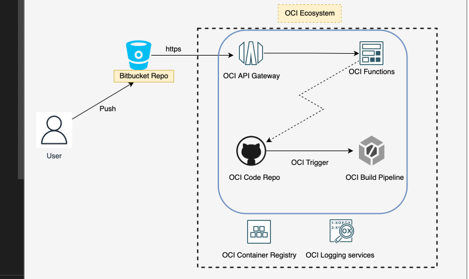
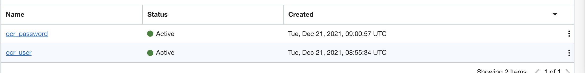
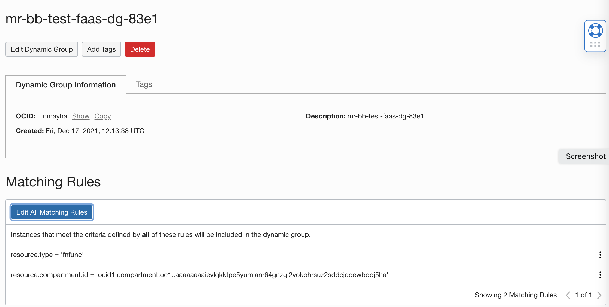
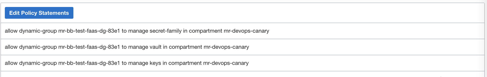
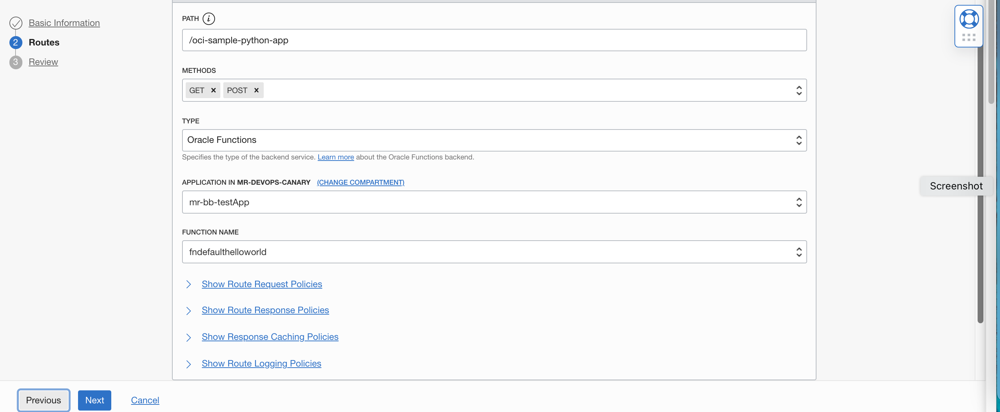
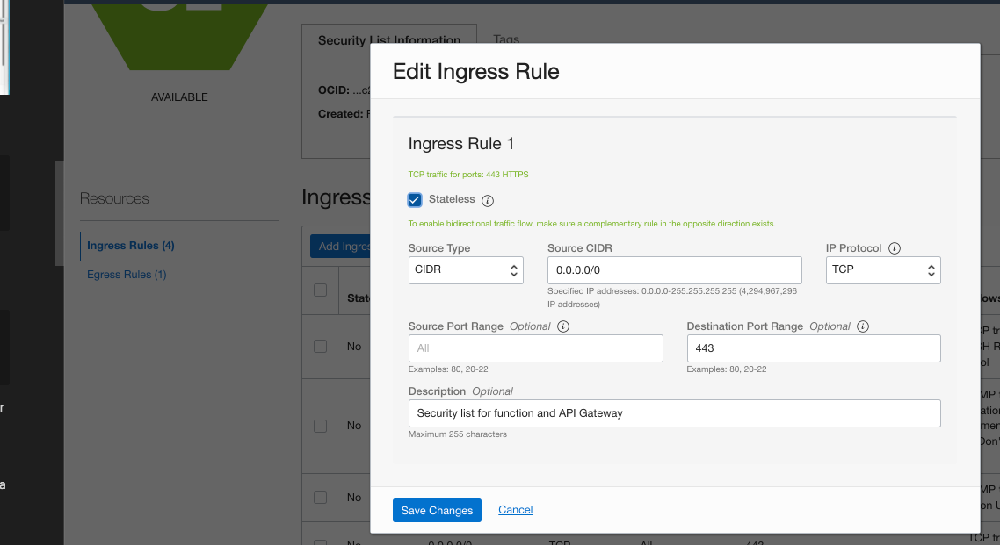

A sample illustration of API Gateay with Function to invoke a build pipeline using Bit Bucket Webhook .

-----------
🔔  Objective :

-   Its an illustration to invoke a OCI devops build pipeline using API Gateway and OCI Functions with Bitbucket.

ℹ️  Summary of  Interactions

- Trigger of webhook from Bitbucket based on a push or commit.
- OCI API Gateway gets invoked and intern trigger an OCI Functions.
- OCI Function will fetch the contect from Bitbucket repo and update the OCI Code Repo.
- OCI Devops trigger will be invoked and a build pipeline will be triggered.



🗨️ How to Setup (You may skip /refer document according to your environment).

📗 1 - OCI Vault

----------------

- Create or use an existing Vault - https://docs.oracle.com/en-us/iaas/Content/KeyManagement/home.htm.

- Setup secrets oci_ocr_user & oci_ocr_password 

- Ensure to setup the exact username and password that can be used to interact with OCI Code repo.

- Code repo reference for read. - https://docs.oracle.com/en-us/iaas/Content/devops/using/managing_coderepo.htm 



📗 2 - OCI Function

----------------

-   Login to cloudshell or an OCI operator instance or your local machine where you have access to OCI.

- Clone the repo.

```
$ git clone https://github.com/RahulMR42/oci-apigateway-function-webhook 

```

- Create an OCI Function application - https://docs.oracle.com/en-us/iaas/Content/Functions/Tasks/functionscreatingapps.htm#Creating_Applications 

- Create your local machine / or cloud shell or operator with Application context.
- Refer the documentation or quick start via the console to set the all the contexts.
- Create an OCI Dynamic group to consider all the function objects inside the compartment

```
resource.type = 'fnfunc'
resource.compartment.id = 'ocid1.compartment.oc1..xx'

```


- Build the functions with the custom code.
- Update func.yaml the OCID of secrets oci_ocr_user_id & oci_ocr_password_id .
- Update the func.yaml with your devops project /tenacy 

```
$ cd oci-apigateway-function-webhook 
$ fn deploy -v --app <application name>

```

- Create a policy for function to read vault secrets,with below policy statements.

```
allow dynamic-group <fn dg name> to manage secret-family in compartment <compartment name>	
allow dynamic-group <fn dg name> to manage secret-family in compartment <compartment name>
allow dynamic-group <fn dg name> to manage vault in compartment <compartment name>	
allow dynamic-group <fn dg name> to manage vault in compartment <compartment name>
allow dynamic-group <fn dg name> to manage keys in compartment <compartment name>
```



- Enable logging of function application via the console.


📗 3 - OCI Gateway

---------

- Create an OCI Gateway https://docs.oracle.com/en-us/iaas/Content/APIGateway/home.htm 
- Create a new deployment ,do basic configurations 


- Use CORS and Rate limit ,you may add additional CORS or or filter later.

- Add gateway deployment route type as function ,set the values as accordingly.

```
- method : GET & POST 
- A route value (path)
- Select Oracle functions > Application name > Function name
```




- Create a dynamic group refering to the Gateway with below rules.

```
ALL {resource.type = 'ApiGateway', resource.compartment.id = 'ocid1.compartment.oc1..xx'}
```


- Create a policy for gateway dynamic group to access the OCI Functions with below policy statements.

```
Allow dynamic-group <dg-api-gateway> to use functions-family in compartment <compartment name>
```

- Create an ingress rule to accept inbound traffic for your function and gateway.
- Got to VCN ,select the subnet where the OCI function application resides.
- select  "Default Security List for your VCN" & Add a new Ingress rule as mentioned below.




📗 4 - OCI DEVOPS CODE Repo

---------

- Create a devops project / A Code repo - https://docs.oracle.com/en-us/iaas/Content/devops/using/managing_coderepo.htm 

- This will be the repo that we will be using with OCI ecosystem for the sample build runner.


📗 5 - Bitbucket Setups

---------

- Create a bitbucket repo.
- Push the content to bitbucket for tests Or you can upload manually ,ensure to have build_spec.yaml file.

```
git remote add bitbucket <bitbucket reference>
git push bitbucket main:main 
```


- Create a webhook using API gateway URL (It must be absolute url with path prefix etc).


📗 5 - Create a test OCI Build pipeliine/stage

---------

- Create a build pipeline in the same OCI devops project.


- Add a build stage with manage build type and the OCI Repo.


- Create a OCI trigger with the repo and the build pipeline.


- Refer the document for all the policies https://docs.oracle.com/en-us/iaas/Content/devops/using/managing_build_pipelines.htm.


📗 7 - Tests

--------

All set !!! Lets test .

- touch a dummy file & push to bitbucket.

```
$ Go to the cloned folder.
$ echo "test" >test.txt
$ git add -A;git commit -m "test to bb"
$ git push bitbucket main:main
```

- Validate the webhook execution via bitbucket ui.


- Validate the build pipeline /it must be executed automatically 


- You can refer the OCI code repo and validate the commits details as well .


- For any errors or details ,refer the functions logs via Application > Logs  .


🎵 Tail end 

- You can add /restrict access with ratelimit / tls / or explcit control inside the function (like allow only if the incommig user is part of alist from vault ) etc .